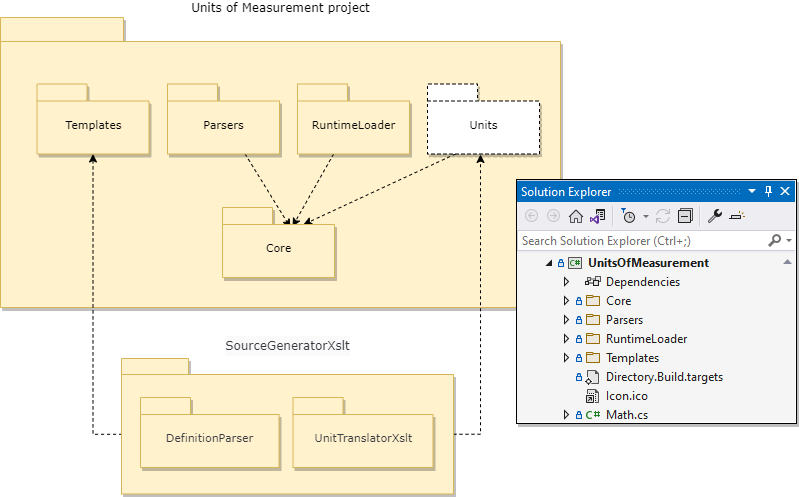
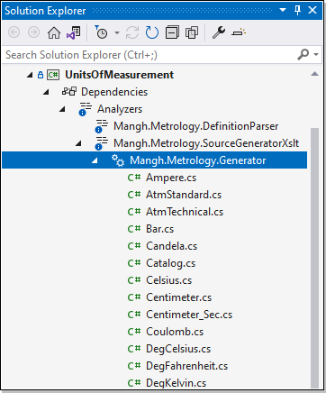

# Components
There is a separate folder for each component:
  - `Core` : basic logic for units of measurement,
  - `Templates` : definitions and XSLT templates for unit/scale structs,
  - `Parsers` : functionality to parse quantities/levels given in text form (as a number with a unit symbol) into a result of type `IQuantity<>` / `ILevel<>`,
  - `RuntimeLoader` : functionality to extend the set of compile-time units/scales with new units/scales at run-time,
  - `[Units]` : compiler internal (virtual) storage that is created at compile-time.

At build time, the C# compiler calls into the `Mangh.Metrology.SourceGeneratorXslt` package to generate unit/scale structures and this is performed in two stages via the following libraries:
  - `Mangh.Metrology.DefinitionParser` : parses definitions into an intermediate form,
  - `Mangh.Metrology.UnitTranslatorXslt` : translates, by means of XSLT templates, the output of the parser into C# structs.

 

Note: `Parsers` and/or `RuntimeLoader` can be safely removed from the project without breaking the remaining functionality.

 

## Core
Basic logic for units of measurement:
* `Dimension` : provides dimensional aspect (sense) of units (_Length_, _Time_, _Mass_, _Temperature_ etc.),
* `SymbolCollection` : supports multiple symbols to identify a unit (e.g.: _"m"_, _"meter"_, _"metre"_ for _Meter_),
* `IQuantity<T>` : an interface to be implemented by a unit type,
* `Unit<T>` : proxy type for handling unit types (as if they were a variable),
* `ILevel<T>` : an interface to be implemented by a scale type,
* `Scale<T>` : proxy type for handling scale types (as if they were a variable),
* `ScaleReferencePointAttribute` : family id attributed to scales to distinguish their families

where: `T` = `double` | `float` | `decimal`. 

 

## Templates
Definitions and XSLT templates for units and scales:
* `definitions.txt` : definitions for unit & scale types and their relationship,
* `unit.xslt` : template for a single unit (_struct_),
* `scale.xslt` : template for a single scale (_struct_),
* `catalog.xslt` : template for `Catalog` (_class_) i.e. catalog of all units and scales provided at compile-time,
* `aliases.xslt` : template for `Aliases.inc` file that may be used to import defined unit and scale types to dependent projects,
* `report.xslt` : template for `generator_report.txt` file (a summary of generated units and scales).

 

## [Units]
Compiler (virtual) folder for the generated units and scales. At compile time, the source generator creates units and scales and passes them to the C# compiler, which then saves them in its internal (readonly) storage. When working in _Visual Studio_ (but not _Visual Studio Code_) you can look in there to see the generated classes:

 

## Parsers
* `QuantityParser<T>`: converts _quantities_ given as a string (number with a unit symbol, e.g.: `"1.093613 yd"`) into `IQuantity<T>` values,
* `LevelParser<T>`: converts _levels_ given as a string (number with a unit symbol, e.g.: `"32 °F"`) into `ILevel<T>` values,
* `NumericParser`: provides delegates for the `<T>.TryParse` methods (from the standard library) to convert strings into numbers.

See the [User Guide](UserGuide.md) for an example of use.

 

## RuntimeLoader
This is a functionality that allows you to extend the set of compile-time units/scales (`Catalog`) with new units/scales at run-time. It gets the (late) definitions from a text file. Late definitions have the same syntax as compile-time definitions and can refer to compile-time units/scales in exactly the same way as if they were specified at compile time.

The loader requires:
* `Mangh.Metrology.DefinitionParser` and
* `Mangh.Metrology.UnitTranslatorXslt`

libraries at runtime: that relationship is not shown on the component diagram above!

See [User Guide](UserGuide.md) for an example of use.

 

----