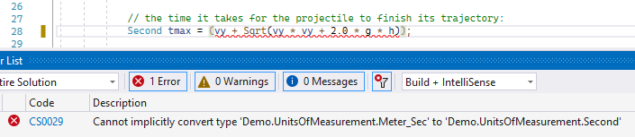

## Example
Look at the following code sample (from [Demo/Bullet/Bullet.Plain.cs](https://github.com/mangh/Metrology/blob/main/Demo/Bullet/Bullet.Plain.cs)):
```C#
public readonly double g = 9.80665; // the gravitational acceleration (Meter/Sec2)
public readonly double v;           // the velocity at which the projectile is launched (Meter/Sec)
public readonly double h;           // the initial height of the projectile (Meter)

public (double, double, double, double) CalculateRange(double slope)
{
    // the angle (in Radians) at which the projectile is launched
    double angle = System.Math.PI / 180.0 * slope;
    // the vertical component of the velocity
    double vy = v * System.Math.Sin(angle);
    // the time it takes for the projectile to finish its trajectory:
    double tmax = (vy + System.Math.Sqrt(vy * vy + 2.0 * g * h));   // <-- UNDETECTED ERROR
    // the total horizontal distance traveled by the projectile
    double xmax = v * System.Math.Cos(angle) * tmax;
    // maximum vertical displacement of the projectile
    double ymax = h;
    for (double t = 0.0; t < tmax; t++)
    {
        var y = h + (vy - g * t) * t / 2.0;
        if (y > ymax) ymax = y;
    }
    return (slope, tmax, xmax, ymax);
}
```
It is hard to see that the expression for `tmax` is wrong: it expects to get _time_ on the left side but the right side calculates _velocity_ instead (it should be further divided by the acceleration `g` to be correct, but that was missed somehow). The expression is syntactically correct, compiles without errors, so it might be handed over to production with the problem unnoticed! 

Now look at the following example (from [Demo/Bullet/Bullet.Measured.cs](https://github.com/mangh/Metrology/blob/main/Demo/Bullet/Bullet.Measured.cs)). This time, units of measurement are explicitly used as types of the variables:
```C#
public readonly Meter_Sec2 g = (Meter_Sec2)9.80665; // the gravitational acceleration
public readonly Meter_Sec v;    // the velocity at which the projectile is launched
public readonly Meter h;        // the initial height of the projectile

public (Degree, Second, Meter, Meter) CalculateRange(Degree slope)
{
    // the angle (in Radians) at which the projectile is launched
#if DIMENSIONAL_ANALYSIS
    Radian angle = Radian.From(slope);
#else
    Radian angle = Demo.UnitsOfMeasurement.Radian.FromDegree(slope);
#endif
    // the vertical component of the velocity
    Meter_Sec vy = v * Sin(angle);
    // the time it takes for the projectile to finish its trajectory:
    Second tmax = (vy + Sqrt(vy * vy + 2.0 * g * h));               // <-- ERROR DETECTED
    // the total horizontal distance traveled by the projectile
    Meter xmax = v * Cos(angle) * tmax;
    // maximum vertical displacement of the projectile
    Meter ymax = h;
    for (Second t = (Second)0.0; t < tmax; t++)
    {
        Meter y = h + (vy - g * t) * t / 2.0;
        if (y > ymax) ymax = y;
    }
    return (slope, tmax, xmax, ymax);
}
```
This time the compiler displays error message, underlines erroneous statement and stops building with this kind of errors left unresolved:



As you can see, C# strong type checking is not strong enough to detect dimensional inconsistencies, but it can be strengthened by unit of measurement types. 

&#128073; Note that the code with units looks very much like the code based on plain numbers. This enables a relatively straightforward tranformation of the code with units to that with plain numbers - see the [User Guide](UserGuide.md), section "Dimensional Analysis vs. Performance" for how this can be done.

<br/>

----