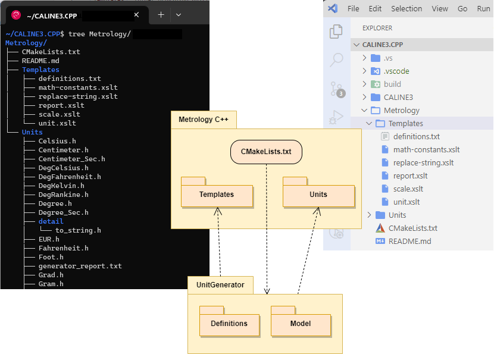

# C++ Project

The project includes:

- `Templates`: folder providing unit/scale definitions and XSLT templates of target structs,
- `Units`: destination folder for generated unit and scale structures (`*.h`).
- `CMakeLists.txt`:  CMake script that builds library of units and scales (as a header-only library of `Units/*.h` files) and makes it available for use in parent/dependent projects.

At build time, the `CMakeLists.txt` script runs the [UnitGenerator](https://www.nuget.org/packages/Mangh.Metrology.UnitGenerator)
(external) tool, which does the job using packages:

- [Definitions](https://www.nuget.org/packages/Mangh.Metrology.Definitions) : reads, verifies and transforms definitions into an intermediate form,
- [Model](https://www.nuget.org/packages/Mangh.Metrology.Model) : translates (using XSLT templates) the verified definitions into target C++ structures.

 

NOTE:

👉 [UnitGenerator](https://www.nuget.org/packages/Mangh.Metrology.UnitGenerator) is a
[dotnet tool](https://learn.microsoft.com/en-us/dotnet/core/tools/global-tools)
that MUST be installed separately BEFORE building such a project!

## Templates

Definitions and XSLT templates of units and scales:

* `definitions.txt` : definitions of units & scales,
* `math-constants.xslt` : stylesheet to be imported into templates that need mathematical constants (such as `PI`, `E`, etc.),
* `replace-string.xslt` : stylesheet to be imported into templates that need the `replace` function not available in `XSLT 1.0`,
* `report.xslt` : template for `generator_report.txt` file (a summary of generated units and scales).
* `scale.xslt` : template for a single scale (_struct_),
* `unit.xslt` : template for a single unit (_struct_),

 

## Units

This is the folder where units and scales are generated as C++ header files (*.h).

⚠️ The `details` subfolder is a permanent part of the project: it contains the finished C++ code, supplementing the code of the generated units/scales. __DON'T DELETE IT!__ ⚠️

On the other hand, the generated *.h files can be safely deleted after build - on the next build they will be automatically restored (albeit at the cost of additional time). Either way, they do not need to be stored in the `git` repository.

 

----