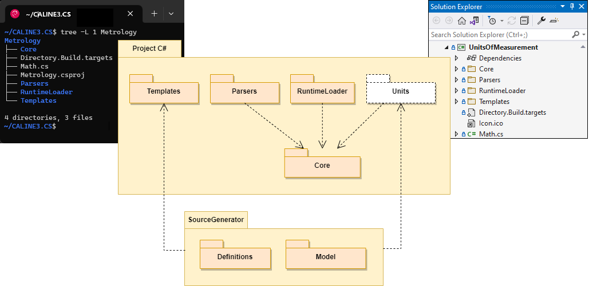
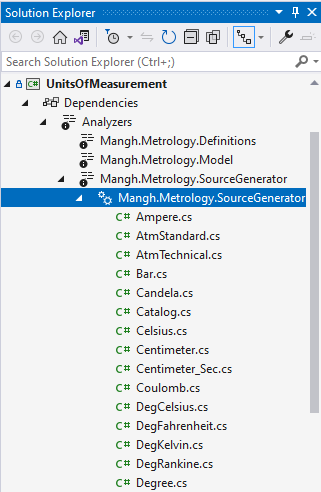

# C# Project

The project code is divided into folders:

- `Core` : basic logic of units of measurement,
- `Templates` : unit/scale definitions and XSLT templates of target structures,
- `Parsers` : transform quantities/levels given in text form into equivalent values of type `IQuantity<T>` / `ILevel<T>`,
- `RuntimeLoader` : extends the set of units/scales available at compile time with new (late) units/scales at runtime,
- `[Units]` : compiler internal (virtual) storage that is created at compile-time.

At build time, the C# compiler runs the [SourceGenerator](https://www.nuget.org/packages/Mangh.Metrology.SourceGenerator) to generate unit/scale structures. The generator does the job using packages:

- [Definitions](https://www.nuget.org/packages/Mangh.Metrology.Definitions) : reads, verifies and transforms definitions into an intermediate form,
- [Model](https://www.nuget.org/packages/Mangh.Metrology.Model) : translates (using XSLT templates) the verified definitions into target C# structures.

 

NOTE:

`Parsers` and/or `RuntimeLoader` can be safely removed from the project without breaking the remaining functionality.

 

## [project root folder]

There are two files that have no meaning (do not give anything) if they remain in their initial form:

- `Math.cs`: a source file that can provide mathematical support for units, e.g. functions: `Sin(Radian)`, `Cos(Radian)` etc.,
- `Directory.Build.targets` : .csproj extension that can be used to export (copy) the generated `Aliases.inc` file to dependent project(s).

 

## Core

Basic logic of measurement units:

* `Dimension` : provides dimensional aspect (sense) of units (_Length_, _Time_, _Mass_, _Temperature_ etc.),
* `SymbolCollection` : supports multiple symbols to identify a unit (e.g.: _"m"_, _"meter"_, _"metre"_ for _Meter_),
* `IQuantity<T>` : interface that is implemented by all units,
* `Unit<T>` : unit proxy (each unit type has its own proxy derived from `Unit<T>`),
* `ILevel<T>` : interface that is implemented by all scales,
* `Scale<T>` : scale proxy (each scale type has its own proxy derived from `Scale<T>`),
* `ScaleReferencePointAttribute` : name of a scale family (attributed to a scale to determine its membership in a particular family).

where: `T` = `double` | `float` | `decimal`. 

 

## Templates

Definitions and XSLT templates of units and scales:

* `Definitions.txt` : definitions of units & scales,
* `Unit.xslt` : template for a single unit (_struct_),
* `Scale.xslt` : template for a single scale (_struct_),
* `Catalog.xslt` : template for `Catalog` (_class_) i.e. catalog of all units and scales provided at compile-time,
* `Aliases.xslt` : template for `Aliases.inc` file that may be used to import unit and scale types to dependent projects,
* `Report.xslt` : template for `generator_report.txt` file (a summary of generated units and scales).

 

## [Units]

A virtual compiler folder (read-only) for generated units and scales. When working in _Visual Studio_ you can look in there to see the generated classes:

 

## Parsers

* `QuantityParser<T>`: converts _quantities_ given as a string (number with a unit symbol, e.g.: `"1.093613 yd"`) into `IQuantity<T>` values,
* `LevelParser<T>`: converts _levels_ given as a string (number with a unit symbol, e.g.: `"32 °F"`) into `ILevel<T>` values,
* `NumericParser`: provides delegates for the `<T>.TryParse` methods (from the standard library) to convert strings into numbers.

See the [User Guide](UserGuide.md) for an example of use.

 

## RuntimeLoader

This functionality allows you to extend the set of compile-time units/scales with new (late) units/scales at run time. Late definitions have the same syntax as compile-time definitions and can refer to compile-time units/scales in exactly the same way as if they were defined at compile-time.

The loader requires:

* `Mangh.Metrology.Definitions` and
* `Mangh.Metrology.Model`

packages at runtime: that relationship is not shown on the component diagram above!

See [User Guide](UserGuide.md) for an example of use.

 

----