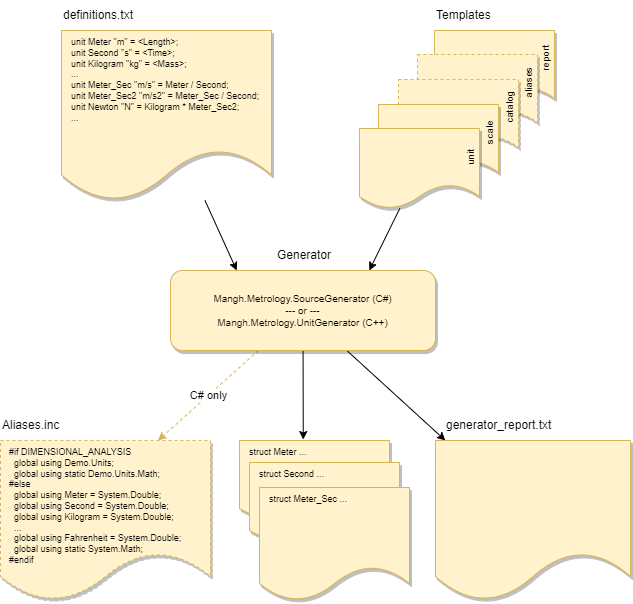
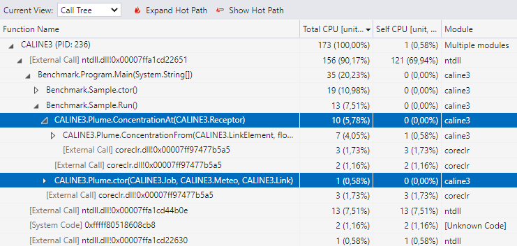

# User Guide

The project generated from the [CSUnits](https://www.nuget.org/packages/Mangh.Metrology.CSUnits)
(or [CPPUnits](https://www.nuget.org/packages/Mangh.Metrology.CPPUnits)) template is a set of files, ready to build a library of measurement units, for use in C# (or C++, respectively) applications. The set consists of:

* initial definitions of units and scales (text file),
* XSLT templates of unit and scale structures for the target language,
* finished source code files,
* build scripts.

For more information on this set, see [C# Project](./ProjectCS.md) (or [C++ Project](./ProjectCPP.md)) page.

<br/>

## Build process

Basically, after creating the project, you just need to specify the required units in the `Templates/definitions.txt` text file.
This is probably the most time-consuming part of the process, especially if you are doing it for the first time
or if you find that many of the required units are missing from the original `definitions` and you have to define them from scratch.
However, the effort you put into it pays off: the definitions, once created, can be used without changes in other projects (both C# and C++).

Once the definitions are ready, you can build the project. The build automatically runs a _generator_ that translates the prepared definitions into unit-of-measurement structures, which are then passed to the compiler as additional code that is an integral part of the (same) project.
The generator used depends on whether it is a [C# Project](./ProjectCS.md) or [C++ Project](./ProjectCPP.md):

- for C# it is [Mangh.Metrology.SourceGenerator](https://www.nuget.org/packages/Mangh.Metrology.SourceGenerator) (called automatically from the C# compiler),
- for C++ it is [Mangh.Metrology.UnitGenerator](https://www.nuget.org/packages/Mangh.Metrology.UnitGenerator) (called automatically from the CMake script).

The generation process is shown in the following diagram:



<br/>

## Sample definitions

Suppose you have prepared the following `definitions.txt` file:

```JS
///////////////////////////////////////////////////////
//
//  Length
//
unit Meter "m" = <Length>; 
unit Kilometer "km" = Meter / 1000;
unit Inch "in" = 100 * Meter / 2.54;
unit Foot "ft" = Inch / 12;
unit Yard "yd" = Foot / 3;
unit Mile "mil" = Yard / 1760;

///////////////////////////////////////////////////////
//
//  Time
//
unit Second "s" = <Time>;
unit Minute "min" = Second / 60;
unit Hour "h" = Minute / 60;

///////////////////////////////////////////////////////
//
//  Velocity
//
unit Meter_Sec "m/s" = Meter / Second;
unit Kilometer_Hour "km/h" = Kilometer / Hour | Meter_Sec * (1/1000) / ((1/60)/60);
unit MPH "mph" "mi/h" = Mile / Hour | Meter_Sec * ((((100/2.54)/12)/3)/1760) / ((1/60)/60);

///////////////////////////////////////////////////////
//
//  Temperature
//
unit DegKelvin "K" "deg.K" = <Temperature>;
unit DegCelsius "\u00B0C" "deg.C" = DegKelvin;
unit DegFahrenheit "\u00B0F" "deg.F" = (9 / 5) * DegKelvin;

scale Kelvin AbsoluteZero = DegKelvin 0.0;
scale Celsius AbsoluteZero = DegCelsius -273.15;
scale Fahrenheit AbsoluteZero = DegFahrenheit -273.15 * (9 / 5) + 32;

///////////////////////////////////////////////////////
// 
//  Currency
//  Note: the rates (conversion factors) below
//  are to be updated on application startup. 
//  See Demo/Currencies application for an example. 
//
unit<decimal> EUR "EUR" = <Money>;          // Euro 
unit<decimal> USD "USD" = 1.3433 * EUR;     // US Dollar 
unit<decimal> GBP "GBP" = 0.79055 * EUR;    // British Pound 
unit<decimal> PLN "PLN" = 4.1437 * EUR;     // Polish Zloty 
```

A _unit definition_, such as the one above for `Kilometer_Hour`, specifies the:

- unit type name: `Kilometer_Hour`,
- unit symbol(s): `"km/h"`,
- underlying value type: `double` is the default, but you can explicitly specify `decimal` or `float` instead,
- relationship with:  
  - `Kilometer` and `Hour` unit, through the arithmetic expression: `Kilometer / Hour`,  
  - `Meter_Sec` unit through the conversion expression: `Meter_Sec * (1/1000) / ((1/60)/60)`.

A _scale definition_, such as the one above for `Fahrenheit`, specifies the:

- scale type name: `Fahrenheit`,
- underlying unit type: `DegFahrenheit`,
- family reference level name: `AbsoluteZero`,
- offset: `-273.15 * (9 / 5) + 32` // position of the `AbsoluteZero` reference level relative to the zero level of the scale.


The library built from these definitions would provide the following unit and scale structures (types), each asigned to the appropriate [conversion family](./Families.md):

| units / scales     | types                                                | family             |
|:-------------------|:-----------------------------------------------------|:-------------------|
| length units       | `Meter`, `Kilometer`, `Inch`, `Foot`, `Yard`, `Mile` | `Meter.Family`     |
| time units         | `Second`, `Minute`, `Hour`                           | `Second.Family`    |
| velocity units     | `Meter_Sec`, `Kilometer_Hour`, `MPH`                 | `Meter_Sec.Family` |
| temperature units  | `DegKelvin`, `DegCelsius`, `DegFahrenheit`           | `DegKelvin.Family` |
| temperature scales | `Kelvin`, `Celsius`, `Fahrenheit`                    | `Kelvin.Family`    |
| currency units     | `EUR`, `USD`, `GBP`, `PLN`                           | `EUR.Family`       |

For more information, see [Definition syntax and semantics](./Definitions.md).
You can also take a look at a
[more elaborate definition example](https://github.com/mangh/Metrology/blob/main/Demo/UnitsOfMeasurement/Templates/definitions.txt).  
That's it (basically). Now you can build the project and use the generated library in your application(s).

<br/>

## Basic Usage

> NOTE: throughout the documentation, I use the term _"quantity"_ for a variable of a _unit type_ and the term _"level"_ for a variable of a _scale type_. See ["Quantities and Units. Levels and Scales"](./Quantities-vs-Levels.md) to find out more about that distinction.

### Expressions with a single unit

Each unit implements arithmetic and comparison operators:

* `+`, `++`, `-`, `--`, `*`, `/` (arithmetic),
* `==`, `!=`, `<`, `<=`, `>`, `>=` (comparison)

just like primitive numeric types (e.g. `double`).  

👉 Therefore, the following expressions can always be used for _quantities in the SAME UNIT_:

```C#
// C#

// Declare two quantities in the same unit (e.g. Yard):
Yard X = (Yard)123.0;    // 123 yd
Yard Y = (Yard)321.0;    // 321 yd

double c = 2.0;          // numerical factor

// Arithmetic
Yard ADD = X + Y;        // Yard + Yard   -> Yard   (444 yd)
Yard SUB = X - Y;        // Yard - Yard   -> Yard   (-198 yd)
Yard MUL = X * c;        // Yard * number -> Yard   (246 yd)
Yard DIV = X / c;        // Yard / number -> Yard   (61,5 yd)
double NUM = X / Y;      // Yard / Yard   -> number (0.3831775700934579378)
Yard NEG = -X;           // -Yard         -> Yard   (-123 yd)
Yard INC = ++X;          // ++Yard        -> Yard   (124 yd)
Yard DEC = X--;          // Yard--        -> Yard   (124 yd)

// Comparison
bool isLT = X < Y;       // Yard < Yard   -> bool   (True)
bool isGT = X > Y;       // Yard > Yard   -> bool   (False)
bool isEQ = X == Y;      // Yard == Yard  -> bool   (False)
bool isGE = X >= Y;      // Yard >= Yard  -> bool   (False)
bool isLE = X <= Y;      // Yard <= Yard  -> bool   (True)
bool isNE = X != Y;      // Yard != Yard  -> bool   (True)
```
  
or:
  
```C++
// C++

// Declare two quantities in the same unit (e.g. Yard):
Yard X{ 123.0 };        // 123 yd
Yard Y{ 321.0 };        // 321 yd

double c = 2.0;         // numerical factor

// Arithmetic
Yard ADD = X + Y;       // Yard + Yard   -> Yard   (444 yd)
Yard SUB = X - Y;       // Yard - Yard   -> Yard   (-198 yd)
Yard MUL = X * c;       // Yard * number -> Yard   (246 yd)
Yard DIV = X / c;       // Yard / number -> Yard   (61.5 yd)
double NUM = X / Y;     // Yard / Yard   -> number (0.383178)
Yard NEG = -X;          // -Yard         -> Yard   (-123 yd)
Yard INC = ++X;         // ++Yard        -> Yard   (124 yd)
Yard DEC = X--;         // Yard--        -> Yard   (124 yd)

// Comparison
bool isLT = X < Y;      // Yard < Yard   -> bool   (1)
bool isGT = X > Y;      // Yard > Yard   -> bool   (0)
bool isEQ = X == Y;     // Yard == Yard  -> bool   (0)
bool isGE = X >= Y;     // Yard >= Yard  -> bool   (0)
bool isLE = X <= Y;     // Yard <= Yard  -> bool   (1)
bool isNE = X != Y;     // Yard != Yard  -> bool   (1)
```
  
However, you cannot multiply `X` by `Y`, either in C#:
  
```C#
var area = X * Y; // Error CS0019 Operator '*' cannot be applied to operands of type 'Yard' and 'Yard'
```
or C++:

```C++
auto area = X * Y;  // error: invalid operands to binary expression ('Yard' (aka '_Yard<double>') and ard')
```
until the product `X * Y` (multiplying Yards) is defined in the `definitions.txt` file, as below (for example):

```JS
unit SquareYard "sq yd" = Yard * Yard;
```
Only such a definition makes both the product and its result (in another unit) acceptable in the source code.

### Expressions with multiple units

👉 The last example reveals a basic rule: expressions with multiple units (or more precisely: expressions that use _quantities in DIFFERENT UNITS_) can be used only if they have been previously defined in the `definitions.txt` file.

The following C# and C++ excerpts compile because `Meter_Sec` has been previously defined as the quotient of `Meter` by `Second`:

```C#
// C#

// Two quantities in different units:
Meter distance = (Meter)306.0;  // 306 m
Second duration = (Second)8.5;  // 8.5 s

// The Meter_Sec definition allows to divide 'distance' by 'duration':
Meter_Sec speed = distance / duration;  // 36 m/s
```

```C++
// C++

// Two quantities in different units:
Meter distance{306.0};  // 306 m
Second duration{8.5};   // 8.5 s

// The Meter_Sec definition allows to divide 'distance' by 'duration':
Meter_Sec speed = distance / duration;  // 36 m/s 
```

### Convertions

👉 Conversions must also be declared explicitly in the `definitions.txt` file:

```C#
// C#

// The definitions used allow you to make the following conversions:
Kilometer_Hour kmph = Kilometer_Hour.From(speed);
MPH mph = MPH.From(speed);

WriteLine($"{distance} / {duration} = {speed} ({kmph}; {mph})");
// 306 m / 8,5 s = 36 m/s (129,6 km/h; 80,52970651395849 mph)

// In C#, each dimensional conversion method
// has a dimensionless counterpart that can be applied to plain numbers:
double kmph_ = Kilometer_Hour.FromMeter_Sec(speed.Value);
double mph_ = MPH.FromMeter_Sec(speed.Value);

WriteLine($"{distance.Value} / {duration.Value} = {speed.Value} ({kmph_}; {mph_})");
// 306 / 8,5 = 36 (129,6; 80,52970651395849)
```
```C++
// C++

// The definitions used allow you to make the following conversions:
Kilometer_Hour kmph = Kilometer_Hour(speed);
MPH mph = MPH(speed);

cout << distance << " / " << duration << " = " << speed << " (" << kmph << "; " << mph << ")" << endl;
// 306 m / 8.5 s = 36 m/s (129.6 km/h; 80.5297 mph)
```

### Comparing quantities/levels in different units

👉 Neither _quantities_ nor _levels_ in _DIFFERENT UNITS_ can be compared: one must first be converted to a unit of the other before comparison:

```C#
// C#
{
    // 100 C == 671.67 R
    Rankine rankine = (Rankine)671.67;
    Celsius celsius = (Celsius)100.0;
    Assert.IsTrue(rankine == Rankine.From(celsius));
    Assert.IsTrue(Celsius.From(rankine) == celsius);
}
{
    // 100 C > 100 R
    Rankine rankine = (Rankine)100.0;
    Celsius celsius = (Celsius)100.0;
    Assert.IsTrue(rankine < Rankine.From(celsius));
    Assert.IsTrue(celsius >= Celsius.From(rankine));
}
```
  
```C++
// C++
{
    // 100 C == 671.67 R
    Rankine rankine { 671.67 };
    Celsius celsius { 100.0 };
    EXPECT_TRUE(rankine == Rankine(celsius));
    EXPECT_TRUE(Celsius(rankine) == celsius);
}
{
    // 100 C > 100 R
    Rankine rankine { 100.0 };
    Celsius celsius { 100.0 };
    EXPECT_TRUE(rankine < Rankine(celsius));
    EXPECT_TRUE(celsius >= Celsius(rankine));
}
  ```

<br/>

## Interfaces and Proxies (C# only)

All of the previous examples refer to quantities in units known at design-time, i.e. refer explicitly to unit names. 
However, sometimes it is necessary to handle quantities/levels in units that we cannot name explicitly.

For example:
_handling a "length" in any unit allowed in the application, but the specific unit will be determined only at run time, for example, when the user selects it from the menu of allowed length units_.

This requires expressions that can represent quantities/levels in an abstract way, regardless of the unit/scale actually used.  
These are (assuming: `T` = `double` | `float` | `decimal`):

* `IQuantity<T>` interface and `Unit<T>` proxy class: each quantity is an expression of type `IQuantity<T>`, in the unit `Unit<T>`.
* `ILevel<T>` interface with `Scale<T>` proxy class: each level is an expression of type `ILevel<T>`, relative to the scale `Scale<T>`.

Using these expressions, it is possible to handle collections of quantities (levels) in a uniform way, even though they are in different units (scales). For example:

```C#
IQuantity<double>[] distance =
{
    (Meter)1.0,
    (Yard)1.0,
    (Inch)10.0
};
for (int i=0; i < distance.Length; ++i)
{
    WriteLine($"distance[{i}] = {distance[i]} ({Meter.From(distance[i])})");
}
```
```C#
// Sample output:
// distance[0] = 1 m (1 m)
// distance[1] = 1 yd (0,9144 m)
// distance[2] = 10 in (0,254 m)
```

NOTE:

* The flexibility offered by `IQuantity<T>` / `ILevel<T>` expressions can be costly.
Converting a quantity (or level) to/from the appropriate interface, e.g.: 
  ```C#
  IQuantity<double> implicitSize = (Meter)123.0;    // boxing
  Meter explicitMeters = (Meter)implicitSize;       // unboxing &
                                                    // exception if implicitSize was not Meter
  ```
  involves the _boxing_/_unboxing_ operation that is costly in terms of performance.
  Therefore, it should be used sparingly: 
  use interfaces in sections that are inherently slow (e.g. data input) and explicit units in sections that need to run efficiently.

* Also pay attention to the exceptions that these conversions can throw. The second assignment (_unboxing_) would throw an `InvalidCastException` exception if performed for `implicitSize`, which is not a Meter. It would be safer to do:
  ```C#
  Meter explicitMeters = Meter.From(implicitSize);  // exception if implicitSize is not 
                                                    // a quantity in the Meter family unit
  ```
  This will work for `implicitSize` in any unit of the Meter family
  (but an `InvalidOperationException` will be reported for all other units).


<br/>

## Catalog (C# only)

The `Catalog` provides information about all units and scales available in the application.
Technically, it is a collection of `Unit<T>` / `Scale<T>` proxies available at _compile time_,
possibly extended at _runtime_ (see `RuntimeLoader` section below).

You can query the `Catalog` for:

| Information on:                                 | Using the method:                        | Returns:                |
| ----------------------------------------------- | ---------------------------------------- | ----------------------- |
| *UNITS*:                                        |                                          |                         |
| A unit with the selected symbol                 | `Unit<T>(string symbol)`                 | `Unit<T>?`              |
| Units of the selected family                    | `Units<T>(int family)`                   | `IEnumerable<Unit<T>>`  |
| Units of the selected dimension                 | `Units<T>(Dimension sense)`              | `IEnumerable<Unit<T>>`  |
| Units underlying the selected scales            | `Units<T>(IEnumerable<Scale<T>> scales)` | `IEnumerable<Unit<T>>`  |
| *SCALES*:                                       |                                          |                         |
| A scale for the selected family and unit symbol | `Scale<T>(int family, string symbol)`    | `Scale<T>?`             |
| A scale for the selected family and unit        | `Scale<T>(int family, Unit<T> unit)`     | `Scale<T>?`             |
| Scales of the selected family                   | `Scales<T>(int family)`                  | `IEnumerable<Scale<T>>` |
| Scales of the selected dimension                | `Scales<T>(Dimension sense)`             | `IEnumerable<Scale<T>>` |

For example:

```C#
// Meter family units:
IEnumerable<Unit<double>> lengthUnits = Catalog.Units<double>(Meter.Family);

Console.WriteLine($"Meter family units: \"{string.Join("\", \"", lengthUnits.SelectMany(u => u.Symbol))}\":");
foreach(Unit<double> unit in lengthUnits)
{
    IQuantity<double> quantity = unit.From(10.0);
    Console.WriteLine($"    {quantity}\t({Meter.From(quantity)})");
}

// Kelvin family scales:
IEnumerable<Scale<double>> temperatureScales = Catalog.Scales<double>(Kelvin.Family);

Console.WriteLine($"Kelvin family units: \"{string.Join("\", \"", temperatureScales.SelectMany(s => s.Unit.Symbol))}\":");
foreach(Scale<double> scale in temperatureScales)
{
    ILevel<double> level = scale.From(100.0);
    Console.WriteLine($"    {level}\t({Kelvin.From(level)})");
}
```
```C#
// Sample output:
// Meter family units: "m", "cm", "mm", "km", "in", "ft", "yd", "mil":
//     10 m        (10 m)
//     10 cm       (0,1 m)
//     10 mm       (0,01 m)
//     10 km       (10000 m)
//     10 in       (0,254 m)
//     10 ft       (3,048 m)
//     10 yd       (9,144 m)
//     10 mil      (16093,439999999999 m)
// Kelvin family units: "K", "deg.K", "°C", "deg.C", "°R", "deg.R", "°F", "deg.F":
//     100 K       (100 K)
//     100 °C      (373,15 K)
//     100 °R      (55,55555555555556 K)
//     100 °F      (310,92777777777775 K)
```
More details can be found in the `Catalog.cs` source code.

<br/>

## QuantityParser and LevelParser (C# only)

These classes have been designed to parse quantities (levels) given as a string
(e.g. `"1.093613 yd"`) into equivalent values of type `IQuantity<T>` (or `ILevel<T>`, respectively).

To make use of them:
* initialize an instance of the parser with an `IEnumerable<Unit<T>>` (`IEnumerable<Scale<T>>`) collection of units (scales) allowed in the input text:
  ```C#
  public QuantityParser(IEnumerable<Unit<T>> allowedUnits)
  public LevelParser(IEnumerable<Scale<T>> allowedScales)
  ```
* use `TryParse` method to get a result of type `IQuantity<T>` (`ILevel<T>`) when the parser finds a valid number with a valid unit symbol in the input text:
  ```C#
  public bool TryParse(string input, out IQuantity<T>? result)
  public bool TryParse(string input, out ILevel<T>? result)
  ```

Now, if you want the user to be able to enter the length in any of the defined length units, you can do it as follows:

```C#
// Allowed units are from the Meter.Family (Meter, Kilometer, Inch, Foot, Yard, Mile):
QuantityParser<double> parser = new(Meter.Family);

Write($"Enter the length (in unit: \"{string.Join("\", \"", parser.Units.SelectMany(m => m.Symbol))}\"): ");
string? input = ReadLine();

if ((input is not null) && parser.TryParse(input, out IQuantity<double>? length))
{
    // Note: here, you can either stay with the received "IQuantity" value,
    // or convert it to an explicit unit (preferred for some reason), or both:
    WriteLine($"Length = {length} ({Meter.From(length!)})");
}
else
{
    WriteLine($"{input ?? "null"}: invalid input; bad number or unit of measurement.");
}
```
```C#
// Sample output for a unit that has been defined (Yard):
//   Enter the length (in unit: "m", "km", "in", "ft", "yd", "mil"): 10 yd
//   Length = 10 yd (9,144 m)

// Sample output for a unit that has NOT been defined (Centimeter):
//   Enter the length (in unit: "m", "km", "in", "ft", "yd", "mil"): 10 cm
//   10 cm: invalid input; bad number or unit of measurement.
```

Note that `QuantityParser<double>` in the example above uses `Meter.Family` in the constructor instead of the collection `IEnumerable<Unit<double>>`: this is because it can query the `Catalog` for the required family and get the collection in return.

<br/>

## RuntimeLoader (C# only)

You can use this functionality to extend the `Catalog` with "late" units/scales  at runtime; "late" means units/scales that have not been included at compile time.

Late units/scales see compile-time units/scales as if they were defined at compile time. This is completely sufficient for conversions in both directions: from late units/scales to compile-time units/scales and vice versa (even though compile-time units/scales remain unaware of late units/scales).

Sample usage with the following definitions in the (example) `LateUnits.txt` file:

```
// NOTE: the definitions below refer to compile-time units (Foot and Meter):
unit Fathom "ftm" = Foot / 6;
unit Cable "cb" = Meter / 185.2;
unit NauticalMile "nmi" = Meter / 1852;
```

```C#
TranslationContext tc = new();
RuntimeLoader ldr = new(tc);
if (!ldr.LoadFromFile("LateUnits.txt"))
	return; // errors when loading late definitions

// Input units limited to the family of the new unit (Fathom)
// i.e. again to the Meter.Family, just extended with new units:
Unit<double> targetUnit = Catalog.Unit<double>("ftm")!;

QuantityParser<double> parser = new(targetUnit.Family);

Write($"Enter the length (in unit: \"{string.Join("\", \"", parser.Units.SelectMany(m => m.Symbol))}\"): ");
string? input = ReadLine();

if ((input is not null) && parser.TryParse(input, out IQuantity<double>? length))
{
    WriteLine($"Length = {length} ({targetUnit.From(length!)}; {Meter.From(length!)})");
}
else
{
    WriteLine($"{input ?? "null"}: invalid input; bad number or unit of measurement.");
}
```
```C#
// Sample output:
//   Enter the length (in unit: "m", "km", "in", "ft", "yd", "mil", "ftm", "cb", "nmi"): 10 yd
//   Length = 10 yd (5 ftm; 9,144 m)
```
The `TranslationContext` (used above) provides output settings for the `RuntimeLoader`:
output folders, output file names, dump options and methods for logging errors that may occur when loading late units.

See [Demo/RuntimeUnits](https://github.com/mangh/Metrology/tree/main/Demo/RuntimeUnits) example for more details.

<br/>

## Dimensional Analysis vs. Performance

### C++

C++ optimizing compilers (such as: GCC, MSVC, CLANG) provide code of no runtime overhead for quantity computations relative to the same code without unit checking.  
You don't need to take any additional steps in the source code to get faster binaries - just enable the compiler's optimization options.

### C#

Algorithms formulated in units of measure are slower than their counterparts using "plain" numbers only.
The table below shows the ratio of the execution times (application with units / application with plain numbers) measured in two benchmark tests (built for .NET 6 and .NET 7):

| Benchmark | .NET 6 | .NET 7 |
| --------- | ----------------------------------- | ----------------------------------- |
| [Bullet Benchmark](https://github.com/mangh/Metrology/tree/main/Demo/Bullet) | `5.45`                               | `2.43`                    |
| [CALINE3 Benchmark](https://github.com/mangh/CALINE3.CS/tree/main/Benchmark) | `1.24` (&#8776; 2.701 ms / 2.177 ms) | `1.13` (&#8776; 958.5 μs / 849.7 μs) |

The lower the ratio, the better.
These results can also be seen in the comments pasted at the end of the source code of the main benchmark modules.

The first benchmark (Bullet) focuses on a single, somewhat artificial method ([Bullet.Measured.Calculator.CalculateRange](https://github.com/mangh/Metrology/blob/main/Demo/Bullet/Bullet.Measured.cs)), which is formulated entirely in units of measurement - there is not a single expression that is free from units. As can be seen, such characteristics translates into a large drop in performance: 2.43 for .NET 7 (or even 5.45 for .NET 6).
This can be considered the maximum performance drop.

The second (CALINE3) is closer to real-world applications but, interestingly, is not as restrained in the use of units, as a much better result (1.24 versus 5.45) would suggest.
In this case, the benchmark measures the execution time of the entire algorithm, which includes both the use of units and standard operations (such as object creation, collection handling, etc.) that are performed regardless of whether units are used or not, and also contribute to the overall execution time.
Measuring unit usage alone in isolation from its context would not make much sense here.
As you can see in the profiler screenshot below, these operations make only a small contribution (cca. 6%) to the overall execution time and this is what accounts for a much better benchmark result, even if the units themselves are 5 times slower:



<br/>

As you may have noticed in the source code of previous examples, there is a way to completely eliminate the performance degradation without major changes to the source code - albeit at the cost of not being able to detect dimensional inconsistencies.

The key idea of this solution is to force the compiler to replace - on the fly - all references to unit structures with references to the corresponding primitive number types, so that, for example, the following excerpt:
```C#
Meter distance = (Meter)306.0;          // 306 m
Second duration = (Second)8.5;          // 8,5 s
Meter_Sec speed = distance / duration;  // 36 m/s
```
would be compiled as:
```C#
double distance = (double)306.0;        // 306
double duration = (double)8.5;          // 8,5
double speed = distance / duration;     // 36
```
This is achieved by:
* `DIMENSIONAL_ANALYSIS` symbol - to be used in dependent projects to control conditional compilation,
* `./Templates/Aliases.inc` file - built automatically at compile-time to provide unit structures or a map to the corresponding primitive number types, for example:
  ```C#
  // Note: the "global using" directives require C# 10
  #if DIMENSIONAL_ANALYSIS
      global using Demo.UnitsOfMeasurement;
      global using static Demo.UnitsOfMeasurement.Math;
  #else
      global using Meter = System.Double;
      global using Centimeter = System.Double;
      // ...
      global using Radian = System.Double;
      global using Degree = System.Double;
      // ...
      global using static System.Math;
  #endif
  ```

* `./Directory.Build.targets` file - to export/copy `Aliases.inc` to dependent project(s), for example:
  ```XML
  <Project>
    <ItemGroup>
      <SourceAliases Include="Templates\Aliases.inc"/>
      <TargetAliases Include="..\Bullet\Aliases.cs"/>
    </ItemGroup>
    <Target Name="CopyAliasesToDependentProjects" AfterTargets="AfterBuild" Inputs="@(SourceAliases)" Outputs="@(TargetAliases)">
      <Copy SourceFiles="@(SourceAliases)" DestinationFiles="@(TargetAliases)" SkipUnchangedFiles="true" />
    </Target>
  </Project>
  ```

* `./Math.cs` file - to enable uniform use of `System.Math` methods, for example:
  ```C#
  // Math.cs
  namespace Demo.UnitsOfMeasurement
  {
      public static class Math
      {
          // the following Sin() definition allows the use of an expression:
          //     Sin(angle)
          // regardless of the type used for the angle: Radian or double
          public static double Sin(Radian angle) => System.Math.Sin(angle.Value);
          // ...
      }
  }
  ```

* conversions - as an exception - require special treatment, directly in the source code, to provide the appropriate (dimensional or dimensionless) version:
  ```C#
  #if DIMENSIONAL_ANALYSIS
    Radian angle = Radian.From(slope);
  #else
    Radian angle = Demo.UnitsOfMeasurement.Radian.FromDegree(slope);
  #endif
  ```

When all these components are ready, just define --or-- remove the `DIMENSIONAL_ANALYSIS` symbol in the dependent project to compile it in the appropriate mode: *with units and reduced performance* --or-- *without units and maximum performance*.

<br/>

## Customizing
In addition to modifying the `definitions.txt` file - in which you specify units and scales - you can also:
* modify XSLT templates to change the structure and/or functionality of (all) generated units/scales,
* create extensions to the generated _partial structs_ for an additional functionality that is required only for selected units/scales and cannot be put in XSLT templates as that would make unwanted changes in all other units/scales. 
  
  For example, you can create the following extensions for the units `Ohm` and `Siemens` to include the relationship `Ohm = 1/Siemens` that applies for these two units only:
  ```C#
  // OhmExt.cs (extension for Ohm.cs)
  public partial struct Ohm { public Siemens Conductance => new(1.0 / Value); }
  ```
  and
  ```C#
  // SiemensExt.cs (extension for Siemens.cs)
  public partial struct Siemens { public Ohm Resistance => new(1.0 / Value); }
  ```
* modify the source code provided with the project template.

<br/>

----